# 软件实现设计说明书

## 1. 概述
本设计面向元数据管理类服务或数据平台控制面，建设背景为上层系统需要统一的 table 管理接口，而底层表语义、元数据约束与演进规则以 Apache Iceberg 1.4.x 文档为准。当前各调用方若直接面向底层 Catalog 或计算引擎能力进行对接，存在接口风格不统一、错误处理不一致、权限审计难收口、实现细节外泄等问题，因此需要建设统一的 table 服务接口层。

本设计目标是对外提供标准化的 table 生命周期管理能力，覆盖创建表、查询表列表、查询表详情、提交表更新、删除表五类核心能力，并补充参数校验、权限校验、审计日志、可观测性和可测试性设计。接口形态采用与 Apache Iceberg 1.4.x REST Catalog 规范强兼容的 HTTP/REST 风格，外部 URL、路径参数、请求体和返回体均保持与官方 OpenAPI 一致，服务内部通过 Iceberg 访问适配层与 Catalog 交互。

本次设计范围聚焦表级 CRUD 与基础查询能力，不纳入 schema 演进、分区演进、快照回滚、分支标签、表维护等高级 Iceberg 运维能力。若后续需要扩展，则以版本化能力增量方式补充，不在本稿内展开实现。

## 2. 服务功能清单
服务清单以表格形式输出，功能清单应包含业务功能和 DFX 功能。

| 类型 | 功能清单 | 功能描述 | 支撑的系统功能 |
|------|----------|----------|----------------|
| 业务功能 | 创建表 | 接收命名空间、表名、Schema、分区配置、表属性等参数，完成 Iceberg table 创建 | 元数据建表、目录初始化、默认属性设置 |
| 业务功能 | 查询表列表 | 按 Iceberg REST Catalog 的 namespace 维度返回 table identifiers 列表 | 控制台列表页、表检索 |
| 业务功能 | 查询表详情 | 返回 Iceberg `LoadTableResult`，包含 metadata、metadata-location、config | 控制台详情页、服务治理查询 |
| 业务功能 | 提交表更新 | 按 Iceberg `CommitTableRequest` 提交表 metadata 更新；当前版本仅支持 `AddSchemaUpdate` | 元数据维护、策略更新 |
| 业务功能 | 删除表 | 删除指定 table，支持安全校验与受保护表拦截 | 元数据下线、资源回收 |
| DFX 功能 | 参数校验与错误码规范 | 统一校验必填项、命名规范、属性白名单、错误返回模型 | 接口治理、调用规范统一 |
| DFX 功能 | 幂等性与重复请求处理 | 在不改变官方外部契约的前提下，对创建、删除、提交更新类操作提供内部重复请求治理 | 防重放、防重复提交 |
| DFX 功能 | 审计日志 | 记录操作者、对象、请求摘要、结果、失败原因 | 审计追踪、问题定位 |
| DFX 功能 | 权限控制 | 按命名空间、表级别能力控制访问范围 | 访问控制、越权防护 |
| DFX 功能 | 可观测性指标与告警 | 采集请求量、失败率、时延、底层 Catalog 异常指标 | 运行监控、故障告警 |
| DFX 功能 | 可测试性设计 | 建立分层测试模型与可注入适配层 | 自动化测试、回归验证 |

## 3. 软件实现设计目标分析与关键要素设计

### 3.1 整体设计目标分析
基于业务功能与 DFX 功能，软件实现设计需满足以下目标：

1. 对齐 Iceberg 1.4.x 的 table 语义与 REST Catalog 契约。接口抽象必须以 Iceberg 官方路径、参数模型和返回模型为准，尤其是创建、加载、提交更新、删除等元数据操作，不额外发明自定义外部契约。
2. 屏蔽底层实现细节。上层系统只感知统一的 table 服务接口，不直接依赖底层 Catalog 类型、存储位置表达方式及 Iceberg 访问细节。
3. 保证工程可落地性。接口设计要兼顾参数约束、一致性控制、安全审计、可观测性和异常映射，能够支撑生产环境运行与排障。
4. 支持后续演进。当前版本限定在基础能力，但接口模型和领域模型要为 schema 演进、分区演进、快照管理等后续能力保留扩展空间。

### 3.2 关键要素设计
结合设计目标分析，本次需要重点完成以下关键要素设计：

| 关键要素 | 设计目标 | 设计说明 |
|----------|----------|----------|
| 接口模型设计 | 统一对外能力表达 | 设计与官方兼容的 createTable、listTables、loadTable、updateTable、dropTable 五类接口及错误模型 |
| Iceberg 元数据映射设计 | 对齐底层语义 | 明确 table 标识、Schema 摘要、分区信息、属性信息与 Iceberg metadata 的映射关系 |
| 异常与约束设计 | 提升接口稳定性 | 规范对象不存在、对象已存在、参数非法、并发冲突、底层 Catalog 异常等错误码 |
| 权限与审计设计 | 满足安全合规要求 | 针对命名空间与表对象进行鉴权，并记录操作审计 |
| 跨系统一致性设计 | 保证多系统状态收敛 | 对 Iceberg、DME、OpenSearch、Local 的顺序写入采用补偿事务机制，任一步失败均触发反向回滚 |
| 可测试性与兼容性设计 | 便于回归与扩展 | 将服务层与 Iceberg 适配层解耦，便于 Mock、集成测试与 Catalog 类型适配 |
| 设计模式应用 | 提升扩展性与可维护性 | 通过适配器、策略、门面与模板化编排模式控制接口兼容、能力收敛和后续演进成本 |

### 3.3 一致性保障设计简述
本方案涉及 Iceberg、DME、OpenSearch、Local 四个系统的串行写入，无法依赖单机事务或分布式强事务一次性提交，因此采用 `事务协调器 + Saga 补偿事务` 的方式保证最终一致性。整体原则如下：

1. Iceberg 作为主状态源，写操作先落 Iceberg，再同步 DME、OpenSearch、Local。
2. 每完成一步，都在事务上下文中记录当前步骤状态和补偿参数。
3. 后续任一步失败时，立即停止向后执行，并按 `Local -> OpenSearch -> DME -> Iceberg` 的逆序执行补偿回滚。
4. 若补偿过程中仍有失败，则将事务标记为待修复状态，并保留 `sagaId`、失败步骤、补偿结果供自动重试或人工处理。

一致性保障流程图如下：

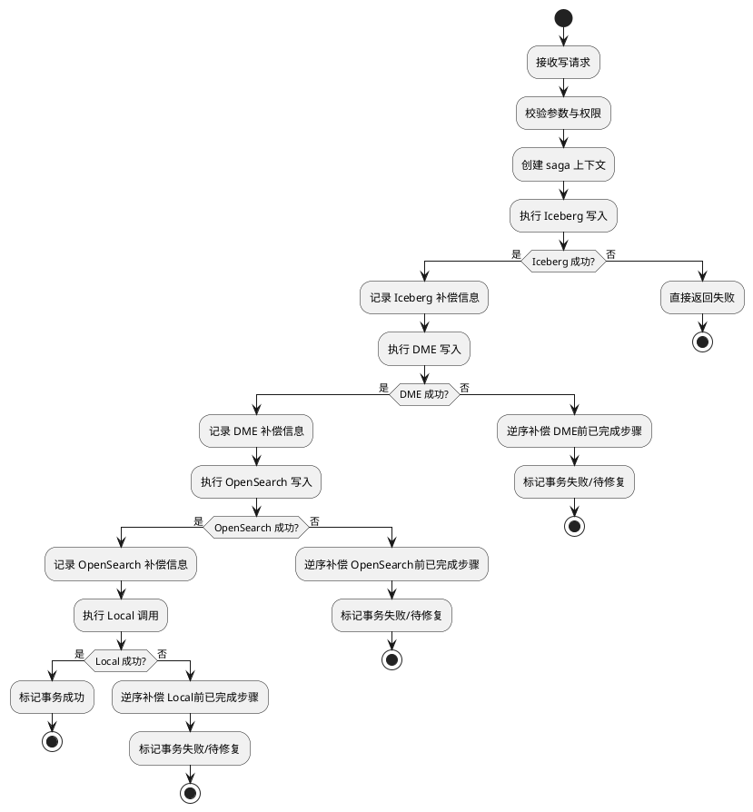

一致性保障时序图如下：

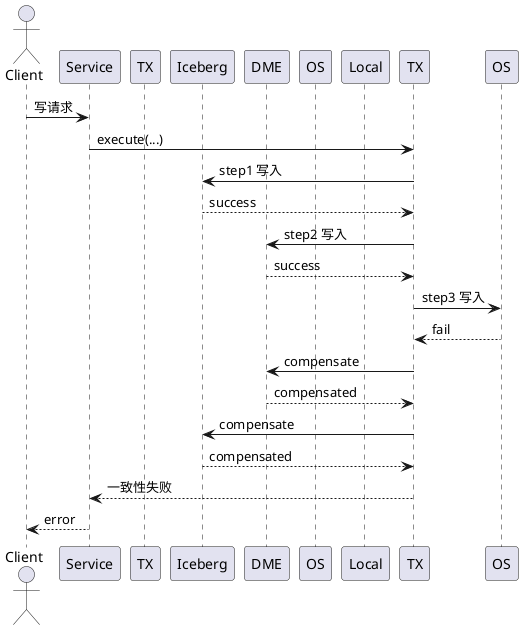

通过上述机制，系统保证“要么四个系统都完成写入并成功返回，要么在失败后尽最大可能把已完成步骤回滚到写入前状态”；若补偿未完全成功，则通过事务状态持久化和后续修复流程保证状态最终收敛。

## 4. 开发视图

### 4.1 实现模型

#### 4.1.1 概述
本软件实现元素内部划分为六类软件单元：

1. API 接入层：负责路由、请求反序列化、参数格式校验、统一响应封装。
2. Table 服务层：负责业务编排、幂等处理、权限校验、审计记录、异常转换。
3. Domain 模型层：负责 table 标识、请求模型、响应模型、错误模型等领域对象定义。
4. Iceberg 访问适配层：封装对 Iceberg Catalog 的访问动作，包括 create/load/list/update/drop 等操作。
5. 外部系统适配层：封装 DME、OpenSearch、Local 系统的写入、删除与补偿回滚动作。
6. 基础设施层：提供鉴权、日志、指标、链路追踪、配置管理等横切能力。

从设计模式角度看，本方案在实现模型中主要采用以下模式：

1. 适配器模式：`IcebergCatalogGateway`/`IcebergCatalogGatewayImpl` 负责把服务内部调用抽象适配到 Iceberg Catalog 或不同底层实现，隔离第三方 API 变化。
2. 门面模式：`TableApplicationService` 对 Controller 暴露统一的 table 生命周期能力入口，屏蔽鉴权、审计、并发控制和 Catalog 访问细节。
3. 策略模式：表更新中的 update 校验与执行按 `action` 维度预留策略扩展点；当前仅启用 `AddSchemaUpdateStrategy`，后续可平滑扩展更多官方 update 类型。
4. 模板化编排模式：创建、更新、删除等写操作遵循“校验 -> 鉴权 -> 读取/提交 -> 审计/指标”的统一处理骨架，降低流程分支散落风险。
5. Saga/补偿事务模式：对于 `Iceberg -> DME -> OpenSearch -> Local` 跨系统链路，不使用分布式两阶段提交，而采用顺序执行加失败补偿回滚的方式保证最终一致性。

#### 4.1.2 上下文视图
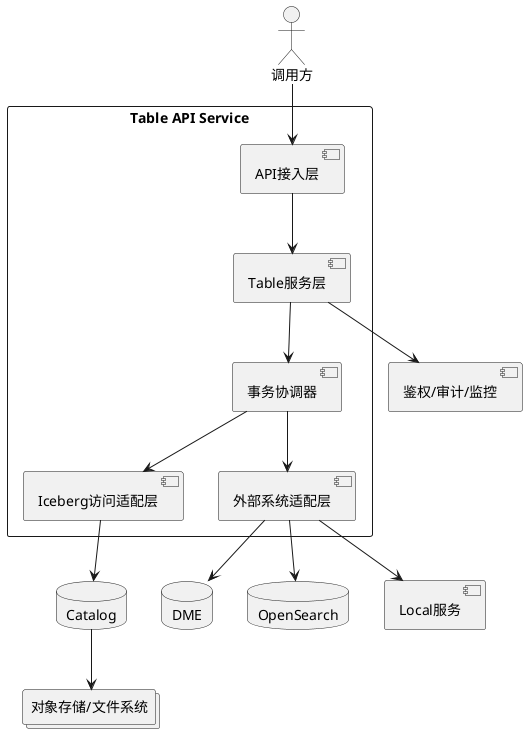

#### 4.1.3 逻辑视图
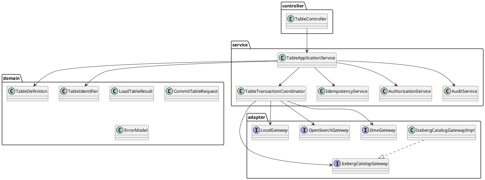

#### 4.1.4 软件实现单元设计
采用类图进行描述，说明每个类的主要职责、接口含义以及类之间的关系。

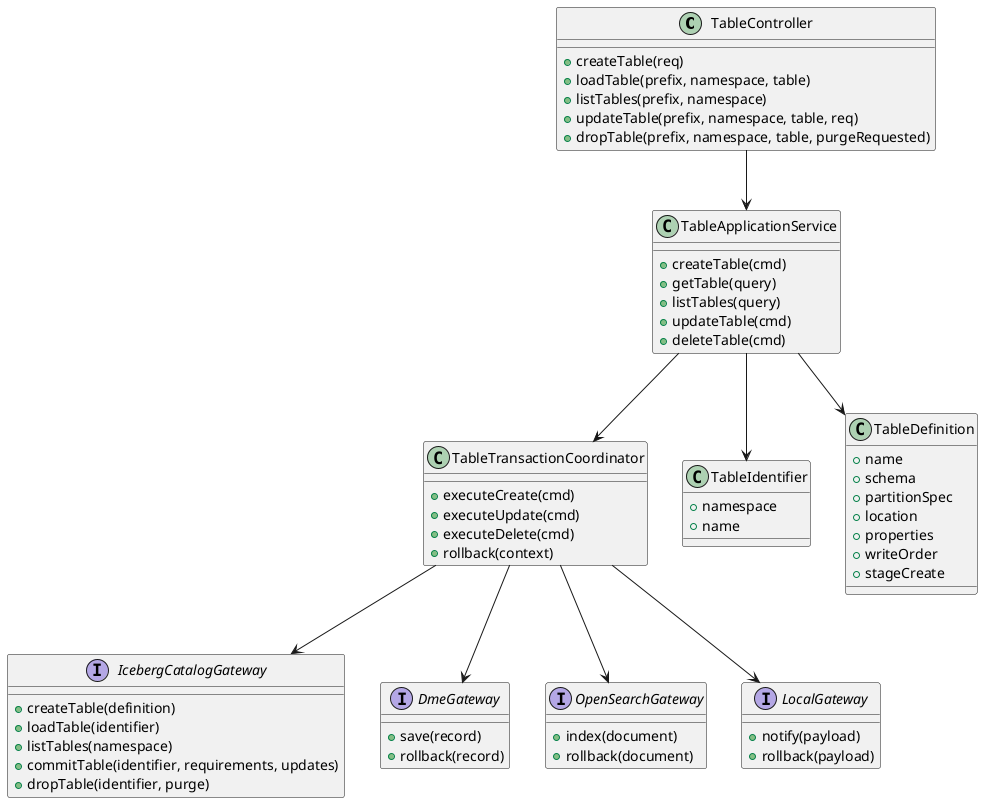

#### 4.1.5 设计模式应用
本方案中设计模式的落地方式如下：

| 模式 | 落地位置 | 解决问题 | 当前体现 |
|------|----------|----------|----------|
| 适配器模式 | `IcebergCatalogGateway` | 隔离 Iceberg Catalog 访问细节与不同底层实现差异 | Controller/Service 不直接依赖第三方 Catalog API |
| 门面模式 | `TableApplicationService` | 对外提供统一业务入口，降低上层接入复杂度 | 对 Controller 统一暴露 create/load/list/update/drop 能力 |
| 策略模式 | Update 校验与执行组件 | 控制不同 `TableUpdate.action` 的差异化处理逻辑 | 当前仅支持 `AddSchemaUpdate`，后续可扩展 `SetPropertiesUpdate` 等策略 |
| 模板化编排模式 | 写操作处理主流程 | 保证校验、鉴权、提交、审计等步骤顺序一致 | create/update/drop 的算法流程结构保持一致 |
| Saga/补偿事务模式 | `TableTransactionCoordinator` | 保证 Iceberg、DME、OpenSearch、Local 的跨系统最终一致性 | 任一步失败按反向顺序回滚已完成动作 |

模式关系图如下：

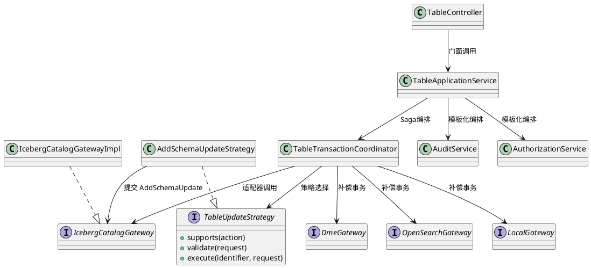

设计模式约束说明如下：

1. Controller 不直接调用 Iceberg SDK 或 Catalog API，必须经由 `TableApplicationService` 与 `IcebergCatalogGateway`。
2. 新增 update 能力时，优先通过新增策略实现扩展，不直接在 `TableApplicationService.updateTable` 中堆叠分支。
3. 公共处理步骤如鉴权、审计、错误映射应保留在模板化编排主流程中，避免下沉到各个具体策略内重复实现。
4. 若未来接入多种 Catalog 实现，应继续通过 Gateway 适配层承接，而非在业务层增加实现分叉。
5. 跨系统写操作必须经由 `TableTransactionCoordinator` 串行执行，不允许 Controller 或单个 Gateway 直接跨系统级联调用。
6. 任一外部系统调用成功后，必须在事务上下文中记录可补偿信息，确保后续失败时能够执行回滚。

接口设计：描述实现单元内部和外部的接口。

接口功能：

| 接口 | 类型 | 接口范围 | 备注 |
|------|------|----------|------|
| `POST /v1/{prefix}/namespaces/{namespace}/tables` | 外部接口 | 服务对调用方 | 创建表 |
| `GET /v1/{prefix}/namespaces/{namespace}/tables/{table}` | 外部接口 | 服务对调用方 | 加载表详情 |
| `GET /v1/{prefix}/namespaces/{namespace}/tables` | 外部接口 | 服务对调用方 | 查询表标识列表 |
| `POST /v1/{prefix}/namespaces/{namespace}/tables/{table}` | 外部接口 | 服务对调用方 | 提交表更新 |
| `DELETE /v1/{prefix}/namespaces/{namespace}/tables/{table}` | 外部接口 | 服务对调用方 | 删除表 |
| `HEAD /v1/{prefix}/namespaces/{namespace}/tables/{table}` | 外部接口 | 服务对调用方 | 检查表是否存在 |
| `IcebergCatalogGateway` | 内部接口 | 服务层对适配层 | 访问 Iceberg Catalog |
| `DmeGateway` | 内部接口 | 事务协调器对 DME | DME 写入与补偿回滚 |
| `OpenSearchGateway` | 内部接口 | 事务协调器对 OpenSearch | 索引写入与补偿回滚 |
| `LocalGateway` | 内部接口 | 事务协调器对 Local | 本地调用与补偿回滚 |
| `AuthorizationService` | 内部接口 | 服务层对基础设施层 | 鉴权 |
| `AuditService` | 内部接口 | 服务层对基础设施层 | 审计日志记录 |

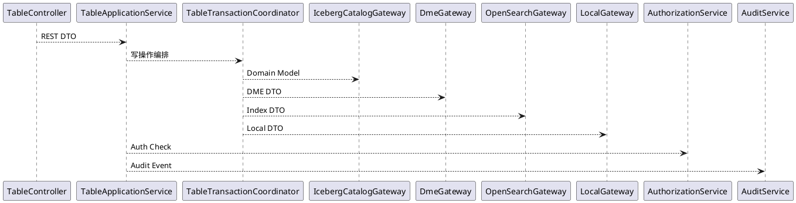

### 4.2 接口

#### 4.2.1 总体设计
接口整体采用 Iceberg REST Catalog 资源化风格，以 table 作为核心资源对象。对外统一使用官方 OpenAPI 中定义的 JSON 请求与响应格式，使用 `namespace + name` 作为 `TableIdentifier`，并通过路径中的 `{prefix}` 承载 catalog 路由前缀。服务层对外不再定义自有 DTO 契约，而是直接兼容 Iceberg 官方 schema，对内通过适配层完成对象转换与底层调用。

首版接口职责划分如下：

| 接口名 | 方法/路径 | 职责 | 成功结果 |
|--------|-----------|------|----------|
| createTable | `POST /v1/{prefix}/namespaces/{namespace}/tables` | 在指定 namespace 下创建表，或在 `stage-create=true` 时返回 staged metadata | 返回 `LoadTableResult` |
| loadTable | `GET /v1/{prefix}/namespaces/{namespace}/tables/{table}` | 加载单表 metadata | 返回 `LoadTableResult` |
| listTables | `GET /v1/{prefix}/namespaces/{namespace}/tables` | 返回指定 namespace 下的所有 `TableIdentifier` | 返回 `ListTablesResponse` |
| updateTable | `POST /v1/{prefix}/namespaces/{namespace}/tables/{table}` | 提交表 metadata 更新；当前版本仅支持 `AddSchemaUpdate` | 返回 `CommitTableResponse` |
| dropTable | `DELETE /v1/{prefix}/namespaces/{namespace}/tables/{table}` | 删除目标表，可通过 `purgeRequested` 请求删除底层数据 | 返回 `204 No Content` |

建议的公共请求/响应模型如下：

| 模型 | 关键字段 | 说明 |
|------|----------|------|
| Namespace | string 数组 | 多层命名空间，如 `["accounting","tax"]` |
| TableIdentifier | `namespace`、`name` | 官方表标识 |
| CreateTableRequest | `name`、`schema`、`location`、`partition-spec`、`write-order`、`stage-create`、`properties` | 官方建表入参 |
| LoadTableResult | `metadata-location`、`metadata`、`config` | 官方加载/创建返回 |
| CommitTableRequest | `requirements`、`updates`、可选 `identifier` | 官方表更新入参；当前版本仅接受 `updates=[AddSchemaUpdate]` |
| CommitTableResponse | `metadata-location`、`metadata` | 官方更新返回 |
| ErrorModel | `message`、`type`、`code`、`stack` | 官方错误模型 |

#### 4.2.2 设计目标
接口设计遵循以下目标：

1. 语义稳定。对外能力以 table 管理为中心，不暴露底层引擎专属操作。
2. 强兼容。外部路径、方法、参数和返回体保持与 Iceberg 1.4.x REST Catalog 一致，不对调用方增加自定义字段。
3. 重试友好。创建、提交更新、删除操作允许服务内部做重复请求治理，但不改变官方请求体定义。
4. 错误清晰。错误响应遵循 Iceberg `ErrorModel`，使调用方可区分参数问题、权限问题、并发冲突与底层故障。
5. 扩展兼容。后续若启用 rename、register、transactions/commit 等能力，可继续复用同一套官方契约。

#### 4.2.3 设计约束
接口设计遵循以下约束条件：

1. 创建表必须使用官方 `CreateTableRequest`；`name` 和 `schema` 为必填字段，namespace 由路径参数承载。
2. 表更新必须使用官方 `CommitTableRequest`；服务不再定义自有 PATCH 模型。当前版本仅接受 `updates` 中包含单个 `AddSchemaUpdate`，其余 update 类型返回 400。
3. 查询详情返回官方 `LoadTableResult`，包含完整 `metadata`、`metadata-location` 及可选 `config`，而非自定义摘要视图。
4. 查询列表返回官方 `ListTablesResponse`，仅包含 `identifiers`，不附加自定义分页和过滤协议。
5. 删除表使用官方 `DELETE` 语义，并通过 `purgeRequested` 查询参数表达是否请求删除底层数据与 metadata。
6. 所有写操作都要经过权限校验、审计记录和并发一致性检查；若要求失败或提交冲突，按官方 `ErrorModel` 返回 409。
7. create/update/delete 成功写入 Iceberg 后，必须继续按 `DME -> OpenSearch -> Local` 固定顺序同步；任一步失败均触发已完成步骤的补偿回滚。

建议错误码如下：

| 错误码 | 含义 | 典型场景 |
|--------|------|----------|
| `ErrorModel.code=404` | 对象不存在 | `NoSuchTableException`、`NoSuchNamespaceException` |
| `ErrorModel.code=409` | 对象已存在或提交冲突 | `AlreadyExistsException`、`CommitFailedException` |
| `ErrorModel.code=400` | 请求参数非法 | 请求体非法、schema/namespace 不合法 |
| `ErrorModel.code=403` | 无权限 | 越权访问 namespace 或表 |
| `ErrorModel.code=409/500` | 跨系统一致性失败 | DME/OpenSearch/Local 任一步失败且触发补偿 |
| `ErrorModel.code=5xx` | 底层或服务异常 | Catalog 不可达、提交状态未知、内部错误 |

#### 4.2.4 技术选型
接口实现默认采用 HTTP/REST + JSON 的控制面服务模式，核心技术选型如下：

| 选型项 | 建议方案 | 选型原因 |
|--------|----------|----------|
| 外部接口风格 | REST | 易于平台、控制台、自动化系统接入 |
| 底层访问方式 | Iceberg Java API / Catalog API 封装 | 能直接对接 table create/load/drop/update 等能力 |
| 元数据操作对象 | Catalog + TableIdentifier | 与 Iceberg 元数据管理模型一致 |
| 并发控制 | 官方 `CommitTableRequest.requirements` + 乐观并发 | 与 Iceberg 元数据提交模式匹配 |
| 序列化格式 | JSON | 通用、可读性高、利于调试 |
| 可观测性 | Metrics + Structured Log + Trace | 支撑接口治理和故障定位 |

#### 4.2.5 接口示例与约束
以下示例均以 JSON 形式给出，并按每个接口分别说明必填项与约束。示例中的 `namespace` 采用单段路径值，若为多段命名空间，路径参数需按 Iceberg 规范使用 `%1F` 连接。

1. `createTable`

请求路径：
`POST /v1/{prefix}/namespaces/{namespace}/tables`

请求体示例：
```json
{
  "name": "orders",
  "schema": {
    "type": "struct",
    "schema-id": 0,
    "fields": [
      {
        "id": 1,
        "name": "order_id",
        "type": "long",
        "required": true
      },
      {
        "id": 2,
        "name": "customer_id",
        "type": "long",
        "required": false
      },
      {
        "id": 3,
        "name": "created_at",
        "type": "timestamp",
        "required": false
      }
    ],
    "identifier-field-ids": [1]
  },
  "partition-spec": {
    "fields": [
      {
        "source-id": 3,
        "field-id": 1000,
        "name": "created_at_day",
        "transform": "day"
      }
    ]
  },
  "write-order": {
    "order-id": 1,
    "fields": [
      {
        "source-id": 3,
        "transform": "identity",
        "direction": "desc",
        "null-order": "nulls-last"
      }
    ]
  },
  "location": "s3://warehouse/orders",
  "stage-create": false,
  "properties": {
    "owner": "data-platform",
    "write.format.default": "parquet"
  }
}
```

成功响应示例：
```json
{
  "metadata-location": "s3://warehouse/orders/metadata/00000-uuid.metadata.json",
  "metadata": {
    "format-version": 2,
    "location": "s3://warehouse/orders",
    "last-column-id": 3,
    "schemas": [
      {
        "type": "struct",
        "schema-id": 0,
        "fields": [
          { "id": 1, "name": "order_id", "type": "long", "required": true },
          { "id": 2, "name": "customer_id", "type": "long", "required": false },
          { "id": 3, "name": "created_at", "type": "timestamp", "required": false }
        ],
        "identifier-field-ids": [1]
      }
    ],
    "current-schema-id": 0,
    "partition-specs": [
      {
        "spec-id": 0,
        "fields": [
          { "source-id": 3, "field-id": 1000, "name": "created_at_day", "transform": "day" }
        ]
      }
    ],
    "default-spec-id": 0,
    "sort-orders": [
      {
        "order-id": 1,
        "fields": [
          { "source-id": 3, "transform": "identity", "direction": "desc", "null-order": "nulls-last" }
        ]
      }
    ],
    "default-sort-order-id": 1,
    "properties": {
      "owner": "data-platform",
      "write.format.default": "parquet"
    }
  },
  "config": {}
}
```

必填项与约束：
- 路径参数 `namespace` 必填。
- 请求体中的 `name`、`schema` 必填。
- `schema.fields[].id/name/type/required` 必填，字段 ID 需唯一。
- `partition-spec`、`write-order`、`location`、`stage-create`、`properties` 选填。
- `stage-create=true` 时返回 staged metadata，但不立即完成建表。
- 若目标表已存在，返回 `409`，错误体使用官方 `ErrorModel`。

2. `listTables`

请求路径：
`GET /v1/{prefix}/namespaces/{namespace}/tables`

成功响应示例：
```json
{
  "identifiers": [
    {
      "namespace": ["sales"],
      "name": "orders"
    },
    {
      "namespace": ["sales"],
      "name": "refunds"
    }
  ]
}
```

必填项与约束：
- 路径参数 `namespace` 必填。
- 响应体仅返回 `identifiers`，不扩展分页、筛选和排序字段。
- `namespace` 不存在时返回 `404`。

3. `loadTable`

请求路径：
`GET /v1/{prefix}/namespaces/{namespace}/tables/{table}?snapshots=all`

成功响应示例：
```json
{
  "metadata-location": "s3://warehouse/orders/metadata/00003-uuid.metadata.json",
  "metadata": {
    "format-version": 2,
    "table-uuid": "84a6f793-5c90-4d3b-a391-8d28f3c7b2f3",
    "location": "s3://warehouse/orders",
    "last-column-id": 4,
    "current-schema-id": 1,
    "schemas": [
      {
        "type": "struct",
        "schema-id": 0,
        "fields": [
          { "id": 1, "name": "order_id", "type": "long", "required": true },
          { "id": 2, "name": "customer_id", "type": "long", "required": false },
          { "id": 3, "name": "created_at", "type": "timestamp", "required": false }
        ]
      },
      {
        "type": "struct",
        "schema-id": 1,
        "fields": [
          { "id": 1, "name": "order_id", "type": "long", "required": true },
          { "id": 2, "name": "customer_id", "type": "long", "required": false },
          { "id": 3, "name": "created_at", "type": "timestamp", "required": false },
          { "id": 4, "name": "order_source", "type": "string", "required": false }
        ]
      }
    ]
  },
  "config": {
    "token": "******"
  }
}
```

必填项与约束：
- 路径参数 `namespace`、`table` 必填。
- 查询参数 `snapshots` 选填，仅支持 `all` 或 `refs`；未传时默认 `all`。
- 成功响应必须返回 `metadata`；`metadata-location` 在 staged 场景下可为空。
- 表不存在时返回 `404`。

4. `updateTable`

请求路径：
`POST /v1/{prefix}/namespaces/{namespace}/tables/{table}`

请求体示例：
```json
{
  "requirements": [
    {
      "type": "assert-current-schema-id",
      "current-schema-id": 0
    },
    {
      "type": "assert-last-assigned-field-id",
      "last-assigned-field-id": 3
    }
  ],
  "updates": [
    {
      "action": "add-schema",
      "schema": {
        "type": "struct",
        "schema-id": 1,
        "fields": [
          { "id": 1, "name": "order_id", "type": "long", "required": true },
          { "id": 2, "name": "customer_id", "type": "long", "required": false },
          { "id": 3, "name": "created_at", "type": "timestamp", "required": false },
          { "id": 4, "name": "order_source", "type": "string", "required": false }
        ]
      },
      "last-column-id": 4
    }
  ]
}
```

成功响应示例：
```json
{
  "metadata-location": "s3://warehouse/orders/metadata/00004-uuid.metadata.json",
  "metadata": {
    "format-version": 2,
    "last-column-id": 4,
    "current-schema-id": 1,
    "schemas": [
      {
        "type": "struct",
        "schema-id": 0,
        "fields": [
          { "id": 1, "name": "order_id", "type": "long", "required": true },
          { "id": 2, "name": "customer_id", "type": "long", "required": false },
          { "id": 3, "name": "created_at", "type": "timestamp", "required": false }
        ]
      },
      {
        "type": "struct",
        "schema-id": 1,
        "fields": [
          { "id": 1, "name": "order_id", "type": "long", "required": true },
          { "id": 2, "name": "customer_id", "type": "long", "required": false },
          { "id": 3, "name": "created_at", "type": "timestamp", "required": false },
          { "id": 4, "name": "order_source", "type": "string", "required": false }
        ]
      }
    ]
  }
}
```

必填项与约束：
- 路径参数 `namespace`、`table` 必填。
- 请求体中的 `requirements`、`updates` 必填。
- 当前版本 `updates` 只允许一个元素，且必须为 `AddSchemaUpdate`，即 `action` 必须为 `add-schema`。
- `AddSchemaUpdate.schema` 必填，`last-column-id` 选填；缺失时可由服务端按官方语义计算。
- 当前版本若 `updates` 中出现 `set-properties`、`remove-properties`、`set-location` 等其它 action，统一返回 `400`。
- 建议 `requirements` 中至少携带 `assert-current-schema-id` 与 `assert-last-assigned-field-id`，用于并发保护；要求失败时返回 `409`。

5. `dropTable`

请求路径：
`DELETE /v1/{prefix}/namespaces/{namespace}/tables/{table}?purgeRequested=false`

成功响应示例：
```json
{}
```

必填项与约束：
- 路径参数 `namespace`、`table` 必填。
- 查询参数 `purgeRequested` 选填，默认 `false`。
- 成功时返回 `204 No Content`；上面的空 JSON 仅用于文档表达“无响应体”，实际接口不返回 body。
- 表不存在时返回 `404`。

6. `tableExists`

请求路径：
`HEAD /v1/{prefix}/namespaces/{namespace}/tables/{table}`

成功响应示例：
```json
{}
```

必填项与约束：
- 路径参数 `namespace`、`table` 必填。
- 成功时返回 `204 No Content`，实际接口不返回 body。
- 表不存在时返回 `404`。

### 4.3 数据模型

#### 4.3.1 设计目标
根据业务模型完成 table 元数据建模，建立官方 REST 请求/响应模型、内部领域模型与 Iceberg metadata 之间的映射关系。建模目标是在保证对外强兼容的前提下，明确服务内部如何消费 `CreateTableRequest`、`CommitTableRequest` 和 `LoadTableResult`。其中 `updateTable` 当前仅消费 `CommitTableRequest` 中的 `AddSchemaUpdate` 子类型。

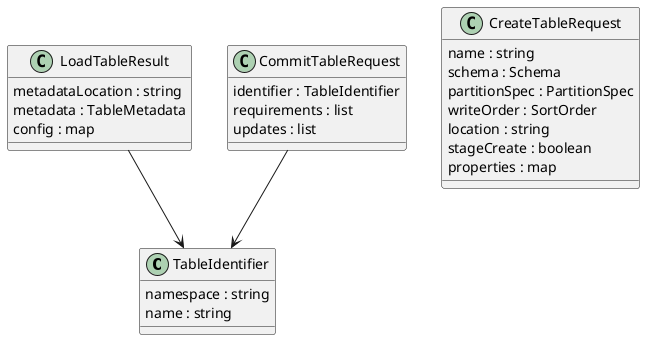

#### 4.3.2 设计约束
数据模型设计遵循以下约束：

1. 外部表标识使用官方 `TableIdentifier`，即 `namespace + name`，不使用自定义 catalog 主键模型。
2. 查询详情与创建响应直接返回官方 `LoadTableResult`，不再裁剪为自定义摘要字段。
3. 表更新请求使用官方 `CommitTableRequest`，并由 `requirements` 和 `updates` 描述并发断言与元数据变更；当前版本只支持 `AddSchemaUpdate`。
4. `properties`、schema、partition spec、sort order 等字段均沿用 Iceberg 官方 schema 命名。
5. 删除后的历史恢复、快照 lineage 等高级行为不作为独立自定义外部模型扩展。

#### 4.3.3 设计选型
数据存储相关设计以“服务无业务主数据持久化，核心状态以 Iceberg metadata 为准”为原则：

1. table 主状态来自 Iceberg Catalog 和 metadata 文件。
2. DME、OpenSearch、Local 均视为 Iceberg 主状态的衍生系统，需要通过事务编排保证状态收敛。
3. 服务侧仅在需要时补充非强一致治理数据，如审计日志、内部重复请求治理记录、指标事件。
4. 外部 API 模型不做二次持久化改写，服务内部适配逻辑只负责官方 schema 到内部执行模型的转换。

#### 4.3.4 数据模型设计
核心数据对象设计如下：

| 对象 | 字段 | 说明 |
|------|------|------|
| Namespace | 字符串数组 | 多层命名空间 |
| TableIdentifier | `namespace`、`name` | 唯一标识 |
| CreateTableRequest | `name`、`schema`、`location`、`partition-spec`、`write-order`、`stage-create`、`properties` | 建表请求 |
| ListTablesResponse | `identifiers` | 列表响应 |
| LoadTableResult | `metadata-location`、`metadata`、`config` | 创建/查询详情响应 |
| CommitTableRequest | `requirements`、`updates`、可选 `identifier` | 更新请求，当前仅支持 `AddSchemaUpdate` |
| CommitTableResponse | `metadata-location`、`metadata` | 更新响应 |
| ErrorModel | `message`、`type`、`code`、`stack` | 通用错误 |

与 Iceberg metadata 的映射关系如下：

| 外部字段 | Iceberg 侧来源 | 说明 |
|----------|----------------|------|
| `TableIdentifier.namespace` | Namespace | 多层命名空间数组 |
| `TableIdentifier.name` | TableIdentifier.name | 表名 |
| `LoadTableResult.metadata-location` | metadata file location | 当前 metadata 文件位置 |
| `LoadTableResult.metadata` | table metadata JSON | 完整表 metadata |
| `LoadTableResult.config` | table config | 表级配置覆盖 |
| `CommitTableRequest.requirements` | commit assertions | 并发断言与前置要求 |
| `CommitTableRequest.updates` | table updates | metadata 更新动作，当前仅支持 `AddSchemaUpdate` |

ER 关系图如下：

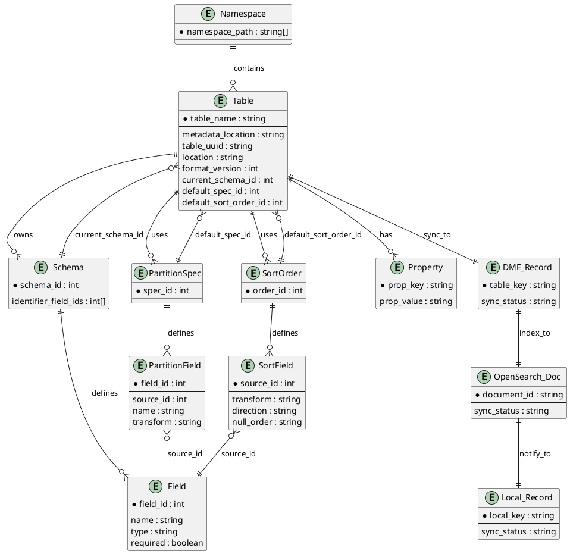

### 4.4 算法设计

#### 4.4.1 设计目标
算法设计目标是确保创建、更新、删除等核心流程具备确定性、可重试性和一致性，重点在流程编排、校验顺序与异常处理，而非复杂计算逻辑。

#### 4.4.2 设计约束
算法设计遵循以下约束条件：

1. 所有写操作先做权限校验和参数校验，再访问底层 Catalog。
2. 对外请求体必须保持官方 schema，不允许在算法层要求调用方增加自定义扩展字段。
3. 对底层并发提交失败需识别并映射为官方 `ErrorModel` 409。
4. 审计日志与指标采集不能影响主流程结果判定，失败时应降级处理。
5. 跨系统写入必须保证顺序固定为 `Iceberg -> DME -> OpenSearch -> Local`，补偿顺序必须与之相反。

#### 4.4.3 设计选型
算法方案采用“编排型服务流程 + 适配层执行”的实现方式：

1. createTable 采用“参数校验 -> 鉴权 -> 调用 Iceberg -> 写入 DME -> 写入 OpenSearch -> 调用 Local -> 全部成功后返回结果；任一步失败触发补偿回滚”的流程。
2. updateTable 采用“读取路径标识 -> 校验 `CommitTableRequest` -> 校验 `updates` 仅包含单个 `AddSchemaUpdate` -> 提交 Iceberg 更新 -> 同步 DME/OpenSearch/Local -> 冲突识别或补偿回滚 -> 返回 `CommitTableResponse`”的流程。
3. dropTable 采用“保护校验 -> 调用 Iceberg 删除 -> 同步 DME/OpenSearch/Local 删除或标记 -> 任一步失败触发补偿恢复 -> 全部成功后返回 204”的流程。

该方案的优点是职责清晰、便于测试、方便后续接入不同 Catalog 实现，同时能够在没有分布式强事务前提下通过 Saga 补偿机制保证跨系统最终一致性。

#### 4.4.4 算法实现
核心流程伪代码如下：

```text
CreateTable(request):
  validate(request)
  identifier = { namespace: path.namespace, name: request.name }
  authorize(identifier, "create")
  if gateway.tableExists(identifier):
      return TABLE_ALREADY_EXISTS
  tx = beginSaga(identifier, "create")
  result = gateway.createTable(request)
  tx.record("iceberg", result)
  dmeGateway.save(buildDmeRecord(result))
  tx.record("dme", result)
  openSearchGateway.index(buildIndexDoc(result))
  tx.record("opensearch", result)
  localGateway.notify(buildLocalPayload(result))
  tx.record("local", result)
  recordAudit("create", success)
  emitMetrics("create", success)
  return result
onFailure:
  rollbackInReverse(tx)
  throw ConsistencyException

UpdateTable(request):
  validate(request)
  identifier = { namespace: path.namespace, name: path.table }
  authorize(identifier, "update")
  current = gateway.loadTable(identifier)
  if current not exists:
      return TABLE_NOT_FOUND
  verifySingleAddSchemaUpdate(request.updates)
  tx = beginSaga(identifier, "update")
  commitResponse = gateway.commitTable(identifier, request.requirements, request.updates)
  tx.record("iceberg", commitResponse)
  dmeGateway.save(buildDmeRecord(commitResponse))
  tx.record("dme", commitResponse)
  openSearchGateway.index(buildIndexDoc(commitResponse))
  tx.record("opensearch", commitResponse)
  localGateway.notify(buildLocalPayload(commitResponse))
  tx.record("local", commitResponse)
  recordAudit("update", success)
  return commitResponse
onFailure:
  rollbackInReverse(tx)
  throw ConsistencyException

DeleteTable(request):
  validate(request)
  identifier = { namespace: path.namespace, name: path.table }
  authorize(identifier, "delete")
  checkProtectedTable(identifier)
  snapshot = gateway.loadTable(identifier)
  tx = beginSaga(identifier, "delete")
  deleted = gateway.dropTable(identifier, purge=request.purgeRequested)
  if deleted == false:
      return TABLE_NOT_FOUND
  tx.record("iceberg", snapshot)
  dmeGateway.rollback(buildDmeRecord(snapshot))
  tx.record("dme", snapshot)
  openSearchGateway.rollback(buildIndexDoc(snapshot))
  tx.record("opensearch", snapshot)
  localGateway.rollback(buildLocalPayload(snapshot))
  tx.record("local", snapshot)
  recordAudit("delete", success)
  return NO_CONTENT
onFailure:
  rollbackDeleteInReverse(tx, snapshot)
  throw ConsistencyException
```

### 4.5 安全实现设计

#### 4.5.1 设计目标
安全设计目标是在不影响基础可用性的前提下，防止未授权访问、危险操作误执行、敏感元数据泄露，并满足操作留痕要求。

#### 4.5.2 设计上下文
本服务处于平台控制面，接口直接操作 table 元数据对象，具备较高权限敏感性。风险主要来自越权访问、错误删除、恶意重复提交、属性注入和审计缺失。

#### 4.5.3 高风险模块
高风险模块及风险点如下：

| 模块 | 风险点 | 说明 |
|------|--------|------|
| CreateTable | 非法 schema/属性注入 | 可能生成不合规表定义 |
| UpdateTable | 越权修改、属性污染 | 可能修改关键治理属性 |
| DeleteTable | 误删、越权删除 | 可能造成业务中断 |
| TransactionCoordinator | 部分成功导致跨系统不一致 | 可能造成 Iceberg、DME、OpenSearch、Local 状态不一致 |
| List/GetTable | 敏感元数据泄露 | 可能暴露 location、内部属性 |
| Internal dedupe | 重复提交同一外部请求 | 可能造成重复执行或审计污染 |

#### 4.5.4 代码实现防范
代码层面采取以下安全防范措施：

1. 对 namespace 和 table 维度执行细粒度鉴权，至少区分读、创建、更新、删除四类动作。
2. 对 `properties` 建立可写白名单，禁止调用方修改保留前缀或系统关键属性。
3. 删除接口增加受保护表校验，可结合标签、命名空间策略或审批态扩展。
4. 对 location 等敏感字段按调用方权限控制是否返回完整值。
5. 审计日志记录请求摘要、操作者、目标对象、结果和失败原因，避免记录敏感全文。
6. 内部若启用重复请求治理，应以请求摘要或网关幂等设施实现，不能改变官方 REST 请求体。
7. 对 DME、OpenSearch、Local 的写入与回滚均需配置超时、重试上限和失败告警，避免长时间悬挂导致补偿失效。
8. 事务协调器需持久化 saga 上下文，至少记录已完成步骤、补偿参数、失败原因和最终状态，便于自动重试与人工修复。

### 4.6 开发者测试模型

#### 4.6.1 设计目标
开发者测试设计目标是保证接口语义、异常映射和并发控制符合预期，并支持 Iceberg 适配层与服务逻辑解耦验证。

#### 4.6.2 设计约束
测试设计约束如下：

1. 单元测试不直接依赖真实 Catalog，优先使用 Gateway Mock。
2. 集成测试需覆盖至少一种可运行的 Iceberg REST Catalog 或兼容实现。
3. 涉及并发与异常映射的测试需可重复执行，避免随机性。

#### 4.6.3 可测试性设计
为提升可测试性，采用以下措施：

1. Controller、Service、Gateway 分层解耦，便于隔离测试。
2. 使用统一错误转换器，便于断言错误码输出。
3. 鉴权、审计、幂等服务通过接口注入，便于 Mock 和故障模拟。
4. 关键流程增加结构化日志字段，便于联调和问题定位。
5. 事务协调器输出 `sagaId`、`stepName`、`stepStatus`、`compensationStatus` 等字段，便于一致性问题排查。

#### 4.6.4 分层测试
测试分层与重点如下：

| 测试层级 | 重点内容 |
|----------|----------|
| 单元测试 | 官方请求体校验、错误模型映射、保护表校验、内部重复请求治理逻辑 |
| 接口测试 | REST 协议行为、官方 URL、状态码、请求响应模型、鉴权失败处理 |
| 集成测试 | 与真实或兼容 Iceberg REST Catalog 交互的 create/load/list/update/drop 流程 |
| 并发测试 | 同表并发更新、重复删除、重复创建的冲突与官方返回行为 |
| 一致性测试 | DME/OpenSearch/Local 任一步失败时的补偿回滚、重试与人工修复链路 |
| 稳定性测试 | Catalog 异常、超时、部分依赖失败时的降级与观测能力 |

## 5. 运行视图

### 5.1 交互模型

#### 5.1.1 设计目标
交互模型设计目标是明确调用方、服务层、Iceberg 适配层与 Catalog 的协作流程，确保核心场景执行路径清晰、可审计、可定位。

#### 5.1.2 设计约束
交互设计需满足以下约束：

1. 所有写请求必须在访问底层 Catalog 前完成鉴权与校验。
2. 查询请求需兼顾最小必要信息返回原则。
3. 审计与指标采集应伴随主流程执行，但不阻塞结果返回。
4. 写请求一旦进入事务协调器，后续必须按固定链路 `Iceberg -> DME -> OpenSearch -> Local` 串行推进。

#### 5.1.3 交互模型设计
创建表交互模型：

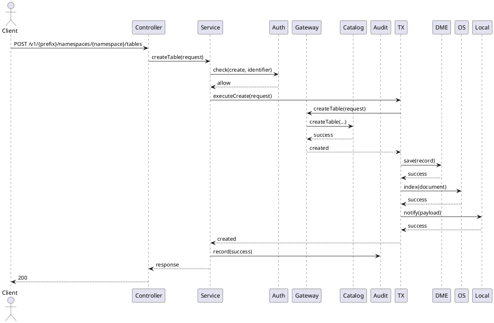

创建表流程图：

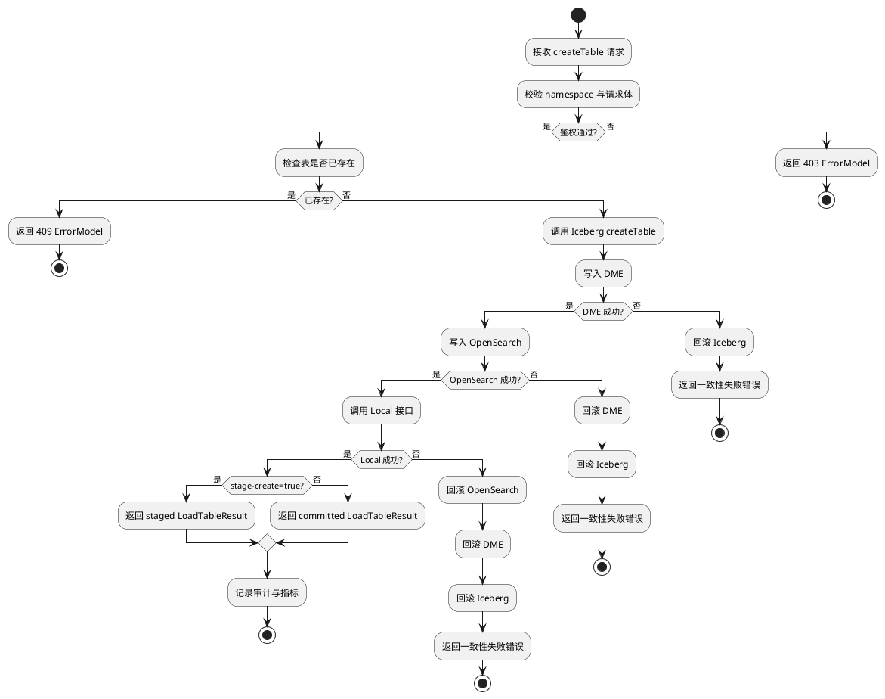

查询详情交互模型：

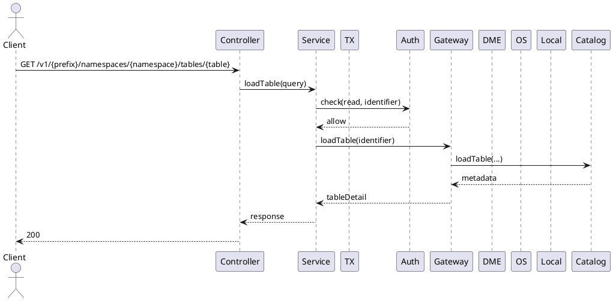

查询详情流程图：

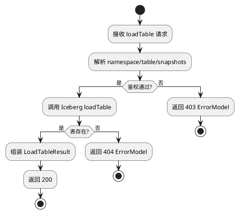

修改表交互模型：

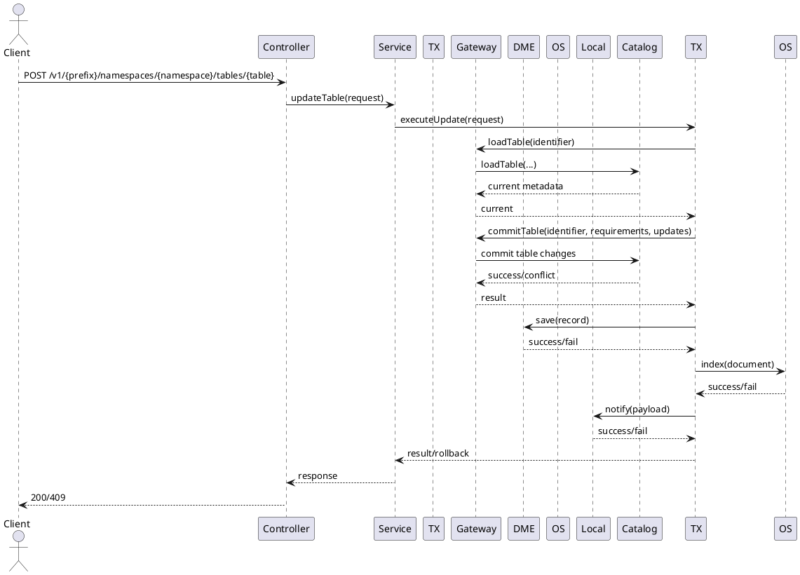

更新表流程图：

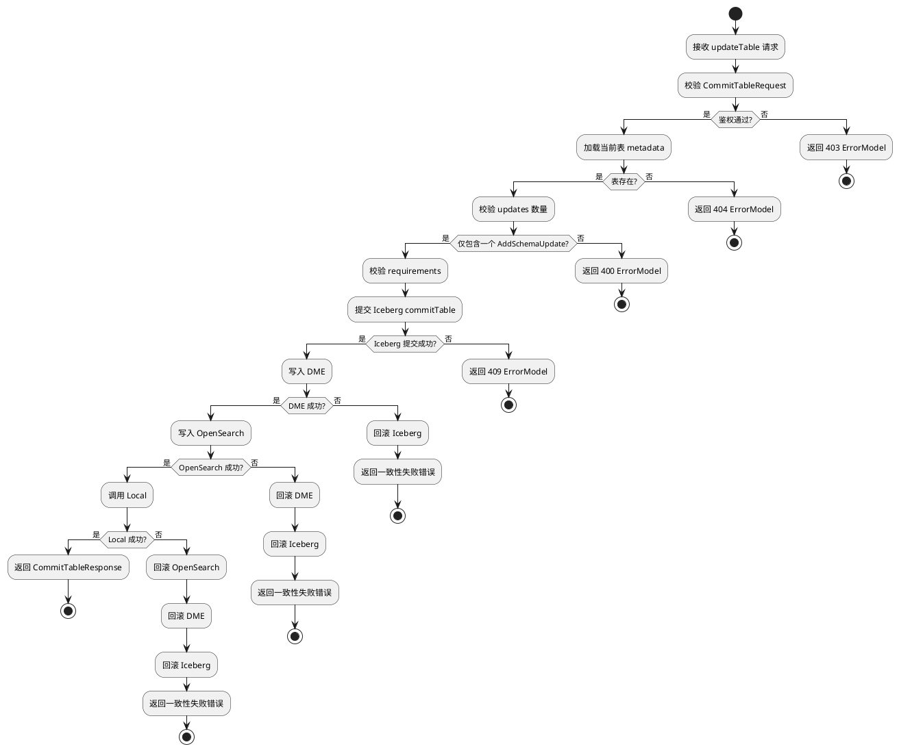

删除表交互模型：

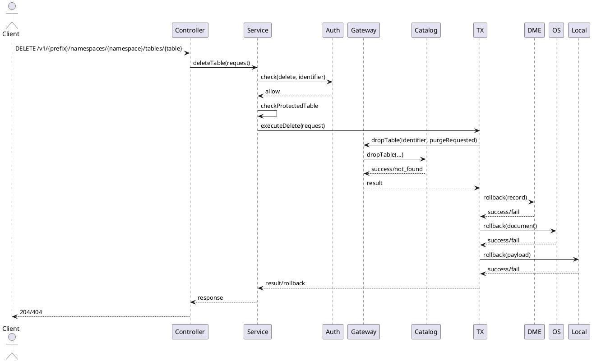

删除表流程图：

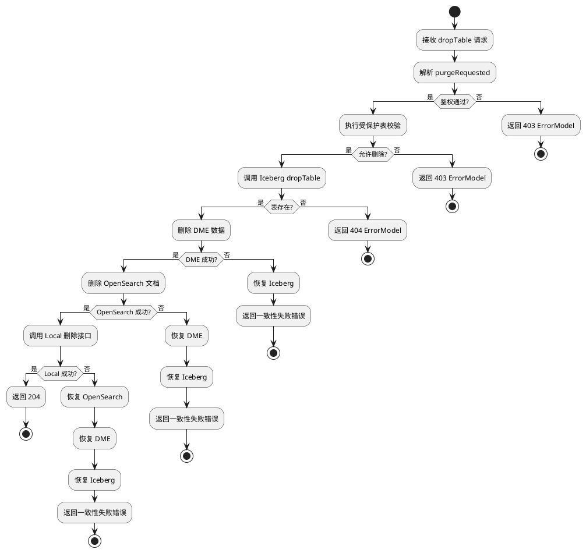

### 5.2 并发模型

#### 5.2.1 设计目标
并发模型设计目标是在多请求同时操作同一张 table 时，保证元数据状态一致、冲突可识别、重复请求可治理。

#### 5.2.2 设计约束
并发设计遵循以下约束条件：

1. Iceberg metadata 更新遵循乐观并发思想，提交时可能出现版本冲突。
2. 同一 table 的并发修改需优先保证一致性，而非最后写入覆盖。
3. 重试请求不能导致重复创建、重复删除或重复审计。
4. 跨系统事务执行期间，必须保证单个 saga 的步骤顺序和补偿顺序可重放、可恢复。

#### 5.2.3 并发模型设计
并发处理机制设计如下：

1. 创建表：若两个请求并发创建同一表，以底层已存在结果返回 409，错误体遵循官方 `ErrorModel`；若 saga 在 DME/OpenSearch/Local 任一步失败，则按 `Local -> OpenSearch -> DME -> Iceberg` 逆序补偿。
2. 提交表更新：并发控制依赖 `CommitTableRequest.requirements` 与底层 metadata commit 的乐观并发机制；要求失败时返回 409；若外部系统失败，则必须回滚 Iceberg 已提交的变更。
3. 删除表：删除操作遵循官方 `DELETE` 语义；首次删除成功返回 204，再次删除返回 404；若后续外部系统补偿失败，则需标记为人工修复任务。
4. 查询操作：查询不加写锁，读取当前可见 metadata 快照；若与写请求并发，以读取到的当前状态为准。
5. 内部若实现重复请求治理，仅作为服务内部机制存在，不在外部契约中增加字段。
6. 事务协调器需为每次写操作分配 `sagaId`，并持久化步骤状态、补偿状态和最终一致性结果。

并发单元划分与协同方式如下：

| 并发单元 | 保护对象 | 协同方式 |
|----------|----------|----------|
| API 请求实例 | 单次请求上下文 | 负责校验、鉴权、幂等判断 |
| Service 写流程 | 单表写操作 | 负责读取当前状态与提交控制 |
| Gateway 提交动作 | Iceberg metadata commit | 依赖底层乐观并发机制 |
| Saga 事务协调器 | 单次跨系统事务 | 负责步骤编排、状态记录、失败补偿 |
| 内部去重存储 | 请求摘要记录 | 负责去重与结果复用 |
