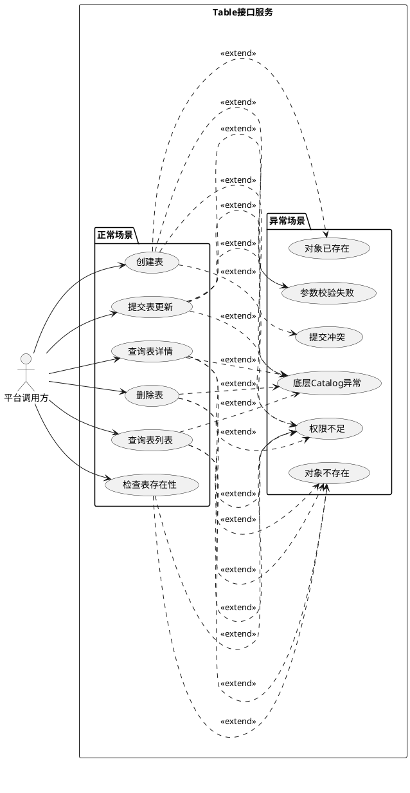
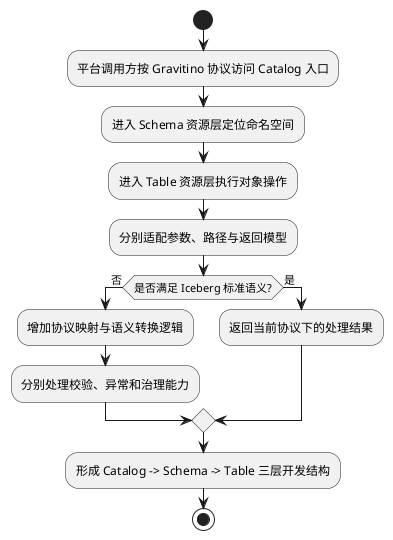
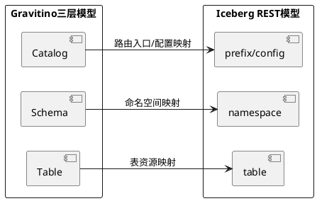
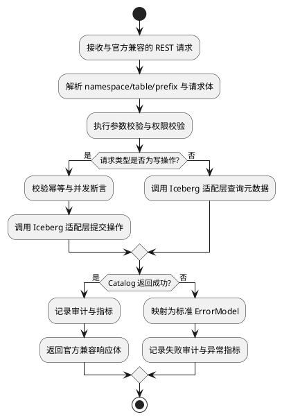
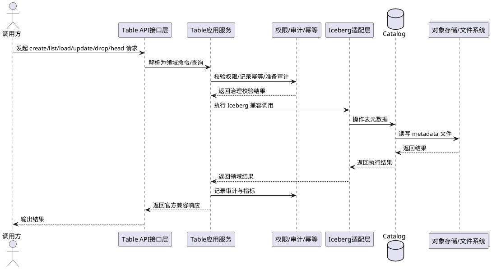

# 需求分析文档

## 1. 需求分析

### 1.1 需求背景
随着数据平台、元数据管理服务和控制面能力持续建设，上层系统对表级元数据管理的统一接入诉求逐步增强。当前不同调用方若直接对接底层 Catalog、计算引擎或各类私有元数据接口，通常会面临以下问题：

- 外部接口风格不统一，不同实现的路径、参数、返回体和错误处理差异较大，增加接入和维护成本。
- Iceberg 表元数据语义、并发提交约束和演进规则复杂，若由上层系统直接感知，容易造成实现细节泄漏和错误使用。
- 权限校验、审计记录、错误码规范、可观测性等治理能力分散在多个接入点，难以形成统一控制面。
- 后续若需要支持更多 Catalog 实现或扩展更多 Iceberg 能力，现有直连模式会带来较高的兼容与演进成本。

结合 [Iceberg_Table接口能力_软件实现设计说明书.md](/Users/a747/codex/Iceberg_Table接口能力_软件实现设计说明书.md) 的设计目标，本需求拟建设一套统一的 Table 服务接口层，对外提供与 Apache Iceberg REST Catalog 强兼容的 HTTP/REST 接口，集中承接表级生命周期管理能力，并统一纳管参数校验、权限校验、审计日志、幂等治理和运行监控能力。

本次需求的核心出发点不是重新定义一套自有表接口协议，而是在 Iceberg 官方 REST 契约基础上，补齐企业级控制面所需的统一入口与治理能力，使上层系统能够以较低成本、安全、稳定地接入表管理能力。

### 1.2 UC设计
本需求的外部使用用户统一定义为“平台调用方”。平台调用方通过统一接口访问表级元数据能力，既包含正常访问场景，也包含参数非法、对象不存在、并发冲突、权限不足等异常访问场景。

用例清单如下：

| 用例名称 | 参与角色 | 触发条件 | 前置条件 | 主流程 | 异常流程 | 输出结果 |
|----------|----------|----------|----------|--------|----------|----------|
| 创建表 | 平台调用方 | 需要在指定 namespace 下新增 Iceberg 表 | 已具备目标 namespace 权限，输入 schema 合法 | 提交建表请求、服务校验参数与权限、调用 Catalog 建表、记录审计、返回建表结果 | 表已存在、schema 非法、无权限、底层 Catalog 异常 | 返回 `LoadTableResult` 或标准错误 |
| 查询表列表 | 平台调用方 | 需要查看 namespace 下的表清单 | namespace 存在且具备读取权限 | 请求列表、服务鉴权、查询 Catalog、返回 identifiers | namespace 不存在、无权限、底层异常 | 返回 `ListTablesResponse` |
| 查询表详情 | 平台调用方 | 需要加载表 metadata 详情 | 目标表存在且具备读取权限 | 请求详情、服务鉴权、查询表 metadata、返回标准结果 | 表不存在、无权限、底层异常 | 返回 `LoadTableResult` |
| 提交表更新 | 平台调用方 | 需要执行 schema 增量更新 | 目标表存在，更新请求满足并发断言和当前版本支持范围 | 提交 `CommitTableRequest`、服务校验与鉴权、提交更新、记录审计 | 断言失败、action 不支持、无权限、提交冲突 | 返回 `CommitTableResponse` 或标准错误 |
| 删除表 | 平台调用方 | 需要下线或清理表 | 目标表存在，操作者具备删除权限 | 提交删除请求、服务校验与鉴权、执行删除、记录审计 | 表不存在、受保护表、无权限、底层异常 | 返回 `204 No Content` |
| 检查表存在性 | 平台调用方 | 需快速探测目标表是否存在 | 已具备基础访问权限 | 调用 `HEAD` 接口、服务鉴权、返回存在性状态 | 表不存在、无权限 | 返回 `204` 或 `404` |

用例关系图如下，覆盖正常场景与异常场景：

### 1.3 需求价值
本需求的价值主要体现在业务标准化、接入效率提升、治理能力统一和后续扩展兼容四个方面。

| 价值维度 | 价值说明 | 当前现状 | 目标改善 |
|----------|----------|----------|----------|
| 接入标准化 | 对外统一 Table 生命周期管理接口，减少多实现差异 | 上层系统需分别适配不同 Catalog/引擎能力 | 统一为兼容 Iceberg REST 的标准入口 |
| 研发效率 | 减少调用方重复封装参数、错误处理和并发控制逻辑 | 每个接入方都需自行处理请求模型与异常映射 | 由服务侧集中提供校验、错误码和治理能力 |
| 治理能力 | 统一接入权限、审计、幂等和可观测性 | 治理能力分散，问题追踪成本高 | 服务层统一收口安全与运维治理 |
| 扩展兼容 | 为后续 schema 演进、分区演进、快照与事务类能力保留扩展空间 | 当前接口若散落各处，后续演进成本高 | 通过兼容官方契约和服务内部解耦提升演进能力 |
| 生态对齐 | 对齐 Iceberg 官方 REST 协议，便于后续兼容多语言、多引擎客户端 | 现有方案缺少统一生态约束 | 形成更强的外部兼容性和生态复用能力 |

综合来看，本需求既是一次接口能力建设，也是一次控制面治理能力建设。其业务收益体现在统一入口和低接入成本，其平台收益体现在标准化、可审计和可扩展。

### 1.4 业务诉求&范围
结合当前设计边界，本次需求的业务诉求与范围如下。

核心诉求：
- 对外提供标准化的 Iceberg Table 管理接口，统一覆盖建表、查表、更新表、删表和存在性检查。
- 接口外部契约尽量保持与 Apache Iceberg REST Catalog 官方规范兼容，降低生态接入成本。
- 在不改变官方请求/响应模型的前提下，补齐企业内部所需的权限、审计、幂等和可观测能力。
- 为后续更多 Table 元数据管理能力提供可演进的服务基础。

范围清单如下：

| 分类 | 内容 |
|------|------|
| 范围内 | 创建表、查询表列表、查询表详情、提交表更新、删除表、检查表是否存在 |
| 范围内 | 参数校验、错误码规范、权限控制、审计日志、幂等治理、可观测性和可测试性设计 |
| 范围内 | 当前版本的表更新仅支持 `AddSchemaUpdate` 类型的 schema 增量更新 |
| 范围外 | schema 全量演进管理、分区演进、sort order 高级管理、快照回滚、分支标签、表维护任务 |
| 范围外 | 事务性多表提交、表注册/重命名、复杂过滤查询、自定义分页和筛选协议 |
| 范围外 | 面向终端用户的数据读写能力、计算引擎 SQL 执行能力 |

依赖与边界说明：
- 底层表语义、元数据约束与提交模型以 Apache Iceberg 官方规范为准。
- 服务面向控制面和元数据管理场景，不直接承担对象存储的数据面读写能力。
- 接口服务需要依赖底层 Catalog、对象存储/文件系统以及统一鉴权、审计、监控等基础设施。

## 2. 方案详设

### 2.1 现状描述
当前在现有开发模式下，接口能力主要基于 Gravitino 协议开展建设，并围绕三层资源结构组织：

1. Catalog：作为顶层资源，负责承载元数据管理入口与资源域划分。
2. Schema：作为 Catalog 下的二级资源，用于组织命名空间或逻辑数据库层级。
3. Table：作为 Schema 下的三级资源，承接具体表对象的创建、查询、更新和删除能力。

基于该协议进行开发在早期能够满足基础元数据管理诉求，但在面向 Iceberg Table 控制面能力建设时，逐步暴露出如下问题：

| 当前环节 | 现有处理方式 | 存在问题 |
|----------|--------------|----------|
| Catalog 层 | 基于 Gravitino 协议暴露顶层资源入口 | 更偏资源分层管理，缺少直接面向 Iceberg REST Catalog 的标准外部契约 |
| Schema 层 | 通过中间层组织 namespace/逻辑库 | 资源层次清晰，但对 Iceberg 官方 namespace 语义存在二次映射成本 |
| Table 层 | 在三层结构下扩展表对象能力 | 容易引入私有路径、私有字段和行为差异，影响生态兼容 |
| 异常处理 | 各层分别处理校验和错误返回 | 错误码、异常语义和调用方感知不够统一 |
| 治理能力 | 权限、审计、监控依附于分层实现 | 难以以 Iceberg Table 对象为中心收口治理能力 |

现状流程可抽象如下：

因此，需要在保留当前资源组织思路可借鉴部分的基础上，建设更贴近 Iceberg REST Catalog 标准的统一 Table 接口服务，将外部能力标准化、内部实现解耦化、治理能力平台化。

### 2.2 Gravitino 三层模型到 Iceberg REST 模型的映射关系
当前现状以 Gravitino 协议的 `Catalog -> Schema -> Table` 三层资源组织能力，而目标方案更强调与 Iceberg REST Catalog 官方协议直接对齐。两者并非完全一一等价，但可以建立如下映射关系，用于指导后续接口改造和适配层设计。

映射关系如下：

| Gravitino 模型层级 | 当前含义 | Iceberg REST 对应概念 | 映射说明 |
|--------------------|----------|-----------------------|----------|
| Catalog | 顶层资源域、元数据管理入口 | `{prefix}` + catalog configuration | Iceberg REST 中更偏向路由前缀和 catalog 配置入口，不直接作为业务资源对象暴露 |
| Schema | Catalog 下的逻辑库/命名空间层 | `namespace` | 是最核心的概念映射，Schema 需要尽量收敛到 Iceberg 官方 namespace 语义 |
| Table | Schema 下的表对象 | `table` | 二者最接近，但外部路径、请求体、返回体需要以 Iceberg 官方 table 资源模型为准 |

进一步说明如下：
- Gravitino 的 Catalog 层在当前实现中承担资源域划分和入口定位职责，而在 Iceberg REST 中更常通过 `prefix` 路由、`/v1/config` 配置协商以及服务端 catalog 实现来体现，因此不建议继续将 Catalog 作为对外强语义业务资源暴露。
- Gravitino 的 Schema 层与 Iceberg 的 namespace 最接近，但需要避免再包装出额外的私有层级语义，尤其是多级 namespace 编码、属性管理和路径映射应优先遵循官方规范。
- Gravitino 的 Table 层与 Iceberg table 资源直接相关，但其路径、更新动作、错误模型和返回结构必须切换到 Iceberg REST Catalog 的标准契约。

映射关系图如下：

### 2.3 竞品分析
本次需求的竞品分析不以“完全同类产品替代”为目标，而是围绕“统一 Table Catalog/API 能力”的设计方向，选取具有代表性的官方实现或产品能力进行对比，包括 Apache Polaris、AWS Glue Iceberg REST Endpoint 和 Databricks Unity Catalog Iceberg REST Endpoint。

竞品对比如下：

| 对比对象 | 主要能力 | 优点 | 局限性/约束 | 可借鉴点 |
|----------|----------|------|-------------|----------|
| Apache Polaris | 基于 Iceberg REST 协议的开放 Catalog 实现，提供 catalog、principal、role、privilege 等管理能力 | 强调开放标准、兼容任意支持 Iceberg REST 的客户端，治理模型清晰 | 更偏完整 Catalog 产品，需要配套管理面和权限模型 | Catalog/Principal/Role 的治理抽象、REST 兼容优先的产品思路 |
| AWS Glue Iceberg REST Endpoint | 基于 AWS Glue Data Catalog 暴露 Iceberg REST API，支持与云上服务集成 | 与 AWS 生态集成紧密，适合云上统一接入 | prefix 与 catalog 路径映射有平台特定约束，namespace 支持存在限制 | 兼容标准协议的同时允许平台特有路由映射；强调与既有 Catalog 体系融合 |
| Databricks Unity Catalog Iceberg REST Endpoint | 在 Unity Catalog 上暴露 Iceberg REST Catalog 接口，支持外部 Iceberg 客户端接入 | 提供统一外部访问入口，并结合 credential vending、权限模型和表类型约束 | 表访问能力与平台治理策略绑定较强，不同表类型支持读写能力不同 | 标准接口与平台治理能力结合的实现方式，外部接入能力与安全策略联动 |

竞品结论：
- 行业主流方向不是重新定义一套私有 Table API，而是在 Iceberg REST Catalog 标准之上做产品化和治理化扩展。
- 一个可落地的控制面接口服务通常需要同时解决“标准兼容”和“平台治理”两类问题。
- 不同产品在路径路由、权限模型、credential vending、namespace 层次等方面会有实现差异，因此本方案应优先保持外部契约兼容，同时将实现差异约束在内部适配层。

对本方案的启发如下：
- 外部能力必须以 Iceberg REST Catalog 为第一优先级，避免后续生态接入困难。
- 内部应预留基于命名空间和表对象的权限扩展点。
- 应明确哪些能力是标准协议内的，哪些能力是平台治理增强能力，避免二者混杂在外部契约中。

### 2.4 详细设计
本节从 Iceberg 接口分析、业务流程、功能模块、权限治理和非功能要求几个方面展开。

#### 2.4.1 Iceberg接口分析
结合 Apache Iceberg 官方 REST Catalog 规范与现有软件实现设计说明书，本需求的接口设计遵循“外部强兼容、内部可适配、治理可增强”的原则。

核心接口范围如下：

| 接口能力 | 方法/路径 | 目标说明 | 本期支持情况 |
|----------|-----------|----------|--------------|
| 创建表 | `POST /v1/{prefix}/namespaces/{namespace}/tables` | 创建 Iceberg 表并返回标准加载结果 | 支持 |
| 查询表列表 | `GET /v1/{prefix}/namespaces/{namespace}/tables` | 返回 namespace 下的表标识列表 | 支持 |
| 查询表详情 | `GET /v1/{prefix}/namespaces/{namespace}/tables/{table}` | 返回标准 `LoadTableResult` | 支持 |
| 提交表更新 | `POST /v1/{prefix}/namespaces/{namespace}/tables/{table}` | 提交 `CommitTableRequest` | 支持，当前仅限 `AddSchemaUpdate` |
| 删除表 | `DELETE /v1/{prefix}/namespaces/{namespace}/tables/{table}` | 删除表并按参数决定是否 purge | 支持 |
| 检查存在性 | `HEAD /v1/{prefix}/namespaces/{namespace}/tables/{table}` | 判断表是否存在 | 支持 |

接口分析结论如下：
- 创建、加载、更新、删除等能力均应尽量沿用 Iceberg 官方请求体与返回体，不新增对调用方可见的私有 DTO。
- 更新能力虽然采用官方 `CommitTableRequest`，但当前版本需显式限制 `updates` 的 action 范围，仅支持 `add-schema`，以降低实现复杂度和误用风险。
- `requirements` 是接口层必须显式尊重的并发保护机制，本方案不应绕过这一层语义。
- `namespace`、`table`、`prefix` 等路径层级需要兼容官方模型，但允许在内部映射至具体 Catalog 实现或平台路由。
- 错误模型以官方 `ErrorModel` 为主，同时在服务内部补充统一日志、监控与审计字段。

本期不支持但属于 Iceberg REST 官方能力范围的接口如下：

| 接口类别 | 方法/路径 | 官方能力说明 | 本期不支持原因 |
|----------|-----------|--------------|----------------|
| Catalog 配置 | `GET /v1/config` | 返回 catalog 配置、默认项、覆盖项及可选 endpoints 信息 | 当前需求聚焦 Table 控制面核心能力，不单独开放配置协商接口 |
| Namespace 管理 | `GET /v1/{prefix}/namespaces` | 列举 namespace | 当前不建设完整 namespace 管理面，避免扩大范围 |
| Namespace 管理 | `POST /v1/{prefix}/namespaces` | 创建 namespace | 本期范围聚焦表级能力，不纳入命名空间生命周期管理 |
| Namespace 管理 | `HEAD /v1/{prefix}/namespaces/{namespace}` | 检查 namespace 是否存在 | 现阶段优先由底层能力承接，不对外单独提供 |
| Namespace 管理 | `GET /v1/{prefix}/namespaces/{namespace}` | 读取 namespace 元数据 | 不作为本期控制面重点 |
| Namespace 管理 | `DELETE /v1/{prefix}/namespaces/{namespace}` | 删除 namespace | 删除 namespace 风险高，且与表级治理边界不同 |
| Namespace 属性 | `POST /v1/{prefix}/namespaces/{namespace}/properties` | 更新 namespace 属性 | 本期不做 namespace 属性治理 |
| 表注册 | `POST /v1/{prefix}/namespaces/{namespace}/register` | 使用已有 metadata 文件注册表 | 首版优先支持标准建表，不支持 metadata register 场景 |
| 表重命名 | `POST /v1/{prefix}/tables/rename` | 重命名表 | 涉及对象标识变更、权限和引用影响，本期暂不纳入 |
| Metrics 上报 | `POST /v1/{prefix}/namespaces/{namespace}/tables/{table}/metrics` | 上报表级 metrics 报告 | 本期可观测性重点在服务端指标，不开放客户端 metrics 上报接口 |
| 多表事务提交 | `POST /v1/{prefix}/transactions/commit` | 多表原子提交 | 实现复杂度高，超出当前单表控制面目标范围 |
| View 管理 | `GET/HEAD/POST/DELETE /v1/{prefix}/namespaces/{namespace}/views...` | 视图列表、创建、加载、更新、删除 | 当前仅聚焦 Table，不建设 View 生命周期能力 |
| View 重命名 | `POST /v1/{prefix}/views/rename` | 重命名视图 | 当前不支持 View，因此不支持其重命名接口 |

边界说明：
- 上述接口均属于 Iceberg REST Catalog 规范中已存在或可选支持的能力，但不在当前版本交付范围内。
- 本期实现重点仍是“单表生命周期管理 + 基础治理能力”，避免因引入 namespace、view、transaction 等能力导致范围失控。
- 后续若扩展相关接口，应继续优先复用官方路径、请求体和错误模型，不单独设计私有契约。

Iceberg 接口分析流程如下：

#### 2.4.2 功能模块设计
建议将能力拆分为以下模块：

| 模块 | 功能点 | 设计说明 | 备注 |
|------|--------|----------|------|
| API 接入层 | 路由、反序列化、入参格式校验 | 对外承接 REST 请求并统一输出标准响应 | 保持路径与模型兼容官方规范 |
| Table 应用服务层 | 能力编排 | 统一编排 create/list/load/update/drop/head 流程 | 屏蔽底层实现细节 |
| Iceberg 适配层 | Catalog 访问封装 | 将服务内部调用适配到底层 Catalog/SDK | 后续支持多种底层实现 |
| 权限与审计模块 | 鉴权、审计、日志记录 | 基于 namespace/table 粒度控制与记录访问行为 | 属于平台治理增强能力 |
| 幂等与一致性模块 | 防重复、并发断言检查 | 为写操作提供重复请求治理和冲突处理 | 不改变官方外部契约 |
| 可观测模块 | 指标、日志、链路追踪、告警 | 支撑运维与问题定位 | 需覆盖成功与失败路径 |

#### 2.4.3 角色权限设计
权限设计建议采用“命名空间 + 表对象 + 操作类型”的组合控制模型。

| 角色/主体 | 允许动作 | 说明 |
|-----------|----------|------|
| 平台调用方 | 查询表列表、查询表详情、检查存在性、按授权创建表 | 面向业务系统和控制台前台能力 |
| 平台管理员 | 全量查询、创建、更新、删除 | 面向治理和运维场景 |
| 自动化治理组件 | 查询、更新、删除 | 需具备独立身份和可审计能力 |

建议最小权限粒度至少支持：
- namespace 级别读、写、管理权限。
- table 级别读、更新、删除权限。
- 高风险操作如删除表、purge、schema 更新需要更严格的权限控制和审计留痕。

#### 2.4.4 异常与边界设计
典型异常场景如下：

| 场景 | 处理原则 |
|------|----------|
| 目标表不存在 | 返回 `404`，并按官方错误模型输出 |
| 表已存在 | 返回 `409` |
| 请求参数非法 | 返回 `400` |
| 无权限访问 | 返回 `403` |
| 并发断言失败 | 返回 `409`，提示提交冲突或状态已变化 |
| 不支持的 update action | 返回 `400` |
| Catalog 或底层存储异常 | 返回 `5xx`，并记录告警与上下文 |

边界约束如下：
- 当前版本不支持多 action 组合更新，不支持 `set-properties`、`set-location` 等其他 update 行为。
- 不提供自定义列表分页与筛选能力，避免偏离官方契约。
- 写操作必须在审计、权限和一致性控制链路通过后才能进入底层 Catalog。

#### 2.4.5 非功能设计
本需求除业务能力外，还需满足以下非功能要求：

| 类别 | 要求 |
|------|------|
| 性能 | 查询接口满足控制面常规低延迟访问；写接口需保证合理的超时与重试策略 |
| 稳定性 | 异常路径可观测、错误可归类、底层故障可快速定位 |
| 安全性 | 所有写操作和敏感读操作必须鉴权；敏感配置与令牌信息不得在响应和日志中明文泄露 |
| 可审计性 | 需记录操作者、对象、动作、结果、失败原因和关键请求摘要 |
| 可测试性 | 通过服务层与适配层解耦支持单测、集成测试和异常场景回归 |
| 可扩展性 | 未来支持更多 update action、更多 Catalog 实现与高级 Iceberg 能力时，尽量不破坏现有外部契约 |

目标方案交互图如下：

## 附录

### 名词解释

| 名词 | 说明 |
|------|------|
| Iceberg REST Catalog | Apache Iceberg 定义的 REST 化 Catalog 协议 |
| Catalog | 表元数据的管理与路由抽象 |
| Namespace | 表所属命名空间，可理解为逻辑层级目录 |
| LoadTableResult | Iceberg 中用于返回表 metadata 的标准响应模型 |
| CommitTableRequest | Iceberg 中用于提交表元数据更新的标准请求模型 |
| AddSchemaUpdate | 当前版本唯一支持的表更新动作，用于新增 schema |

### 待确认事项

| 项目 | 内容 |
|------|------|
| 多级 namespace 支持 | 是否需要在首版中支持完整多级 namespace 路由与编码处理 |
| 受保护表策略 | 删除接口是否需要内置更细粒度的保护规则与审批机制 |
| 幂等实现方式 | 在不改变官方外部契约的前提下，内部幂等键策略如何确定 |
| 鉴权模型来源 | namespace/table 权限与组织身份体系如何对接 |
| 后续扩展顺序 | schema 演进后的下一阶段能力优先级是否包含 set-properties、rename、register 等 |

### 参考资料

#### 竞品分析使用的网站链接
- [Apache Polaris - Using Polaris](https://polaris.apache.org/releases/1.1.0/getting-started/using-polaris/)
- [AWS Glue - Connecting to the Data Catalog using AWS Glue Iceberg REST endpoint](https://docs.aws.amazon.com/glue/latest/dg/connect-glu-iceberg-rest.html)
- [Databricks - Access Databricks tables from Apache Iceberg clients](https://docs.databricks.com/aws/en/external-access/iceberg)

#### Iceberg接口分析使用的网站链接
- [Apache Iceberg - REST Catalog Spec](https://iceberg.apache.org/rest-catalog-spec/)
- [Apache Iceberg OpenAPI YAML - rest-catalog-open-api.yaml](https://github.com/apache/iceberg/blob/main/open-api/rest-catalog-open-api.yaml)

#### Gravitino相关介绍链接
- [Apache Gravitino 官方首页](https://gravitino.apache.org/)
- [Apache Gravitino 官方概览文档](https://gravitino.apache.org/docs/latest/)
- [Apache Gravitino GitHub 仓库](https://github.com/apache/gravitino)
- [Apache Gravitino Lance REST Service 文档（包含 catalog -> schema -> table 三层层级说明）](https://gravitino.apache.org/docs/1.1.0/lance-rest-service/)

### 版本记录

| 版本 | 日期 | 说明 |
|------|------|------|
| v1.0 | 2026-03-25 | 基于现有软件实现设计说明书与官方资料整理首版需求分析文档 |
