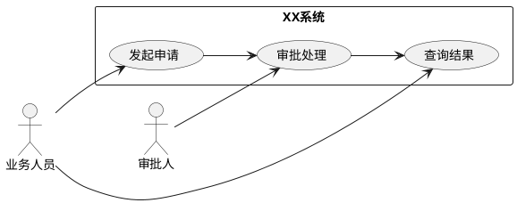
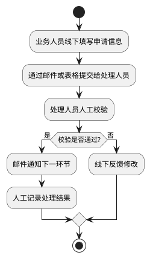
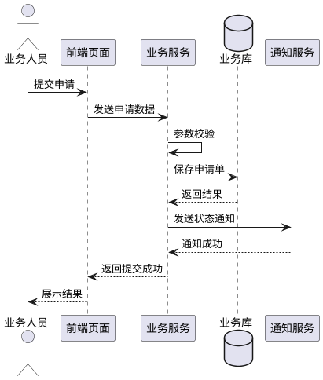

# 需求分析模板

> 说明：本模板用于在方案设计、研发排期、评审沟通前，对需求进行结构化分析。  
> 使用建议：优先说明“为什么做、为谁做、解决什么问题、边界在哪里、方案如何落地”，避免只写功能点而缺少背景、目标和约束。  
> 适用范围：适用于新功能建设、现有功能优化、流程改造、平台能力补齐等场景。
> 制图要求：文中涉及的业务流程图、用例图、时序图、状态图、活动图等，统一使用 PlantUML 绘制，便于版本管理、评审协作与后续维护。

## 1. 需求分析

### 1.1 需求背景
本节用于说明需求提出的来龙去脉，帮助读者快速理解该需求产生的业务环境与问题来源。

建议描述内容：
- 业务背景：当前业务所处阶段、所属产品/系统、涉及的上下游角色。
- 问题现状：当前流程、现有能力或存量方案中存在的痛点。
- 触发原因：客户反馈、业务增长、合规要求、效率问题、稳定性问题或管理要求等。
- 建设目标：希望通过本次需求解决什么问题，达到什么结果。

建议回答的问题：
- 当前为什么要做这件事？
- 如果不做，会带来哪些影响？
- 本次需求与既有系统、既有流程的关系是什么？

参考写法：
> 当前 XX 系统在处理 XX 场景时，仍依赖人工录入/线下流转，存在处理时效长、出错率高、状态不可追踪等问题。随着业务量增长，现有模式已无法满足 XX 部门对效率与可追溯性的要求，因此需要建设 XX 能力，实现 XX 流程线上化、标准化与可视化。

### 1.2 UC设计
本节用于从用户视角梳理使用场景，明确谁在什么条件下，通过系统完成什么动作，并得到什么结果。UC（Use Case，用例）是连接业务需求与方案设计的核心桥梁。

建议描述内容：
- 参与角色：如管理员、运营、审核员、普通用户、外部系统等。
- 触发条件：在什么业务前提下发起该操作。
- 前置条件：执行前必须满足的状态或数据条件。
- 主流程：用户或系统执行的主线步骤。
- 异常流程：失败、回退、驳回、超时、重复提交等场景。
- 后置结果：流程结束后系统状态、数据状态、通知状态发生什么变化。

推荐采用表格描述：

| 用例名称 | 参与角色 | 触发条件 | 前置条件 | 主流程 | 异常流程 | 输出结果 |
|----------|----------|----------|----------|--------|----------|----------|
| 示例：发起审批 | 业务人员 | 提交申请单 | 信息填写完整 | 新建申请、提交审批、系统校验、进入审批流 | 校验失败、重复提交、审批驳回 | 生成审批记录并通知相关人员 |

编写建议：
- 一个用例聚焦一个核心业务动作，不要把多个无关流程混在同一个用例中。
- 主流程要写清楚系统动作，而不仅是用户动作。
- 异常流程至少覆盖校验失败、权限不足、状态冲突、外部接口失败等常见情况。

如需补充用例关系图或业务参与关系图，统一使用 PlantUML，例如：

### 1.3 需求价值
本节用于说明需求的业务价值、管理价值与技术价值，是立项、优先级评估和资源投入判断的重要依据。

建议从以下维度展开：
- 业务价值：提升收入、促进转化、支持新业务、增强客户体验等。
- 效率价值：缩短处理时长、减少人工操作、降低沟通成本、减少重复劳动。
- 管理价值：增强数据可追踪性、规范流程、提升可审计性、沉淀标准能力。
- 技术价值：统一能力底座、减少重复建设、改善稳定性、降低维护成本。

推荐采用“价值点 + 衡量指标”的方式描述：

| 价值维度 | 价值说明 | 当前现状 | 目标改善 |
|----------|----------|----------|----------|
| 效率提升 | 减少人工处理步骤 | 单次处理约 15 分钟 | 目标缩短至 5 分钟以内 |
| 过程可控 | 流程状态可追踪 | 依赖线下沟通确认 | 支持系统内状态流转与日志记录 |
| 能力复用 | 形成通用能力 | 多系统重复开发 | 抽象为统一组件/服务供复用 |

编写建议：
- 尽量避免仅写“提升用户体验”“优化流程”等空泛表述。
- 若有历史数据、业务指标、工单统计、投诉反馈，可作为价值支撑依据。
- 对于内部系统，也应说明其对效率、质量、规范化的实际贡献。

### 1.4 业务诉求&范围
本节用于明确本次需求到底要做什么、不做什么，以及涉及哪些业务边界、系统边界和职责边界，避免后续理解偏差。

建议描述内容：
- 核心诉求：业务方最关注的目标和必须达成的结果。
- 功能范围：本期要交付的功能清单。
- 非功能诉求：性能、安全、稳定性、兼容性、可审计性等要求。
- 不在范围内事项：明确本期不处理、不改造、不承诺的部分。
- 影响范围：涉及的系统、模块、角色、数据对象、上下游接口。

推荐采用“范围内 / 范围外”方式整理：

| 分类 | 内容 |
|------|------|
| 范围内 | 支持 XX 数据录入、XX 流程发起、XX 状态查询、XX 结果通知 |
| 范围外 | 不涉及历史存量数据清洗、不改造移动端、不调整外部系统主数据模型 |

建议回答的问题：
- 本期交付边界在哪里？
- 哪些相关诉求暂不纳入本次建设？
- 是否存在依赖外部团队、外部系统或前置项目的内容？

## 2. 方案详设

### 2.1 现状描述
本节用于客观描述现有业务流程、系统能力、数据链路和组织协作模式，为后续方案设计提供基线。

建议描述内容：
- 当前业务流程：按时间顺序说明现有处理步骤。
- 当前系统支撑情况：哪些环节已系统化，哪些环节仍人工处理。
- 当前数据现状：数据来源、数据流向、数据准确性、是否存在多处维护。
- 当前问题清单：效率低、体验差、易出错、难追踪、扩展性差、重复建设等。

推荐输出方式：
- 流程说明：适合描述线下/线上混合流程。
- 表格对比：适合体现“当前方式 vs 问题点”。
- 若需要表达现状流程，统一使用 PlantUML 活动图或时序图。

示例表格：

| 当前环节 | 现有处理方式 | 存在问题 |
|----------|--------------|----------|
| 信息提交 | 线下 Excel 汇总 | 数据格式不统一，易遗漏 |
| 状态流转 | 人工邮件通知 | 状态不同步，责任边界不清 |
| 结果查询 | 人工反馈 | 查询成本高，无法自助获取 |

现状流程示例：

### 2.2 竞品分析
本节用于借鉴行业成熟方案、同类内部系统或历史项目经验，帮助明确可参考做法与差异化方向。如果没有直接竞品，也可以替换为“同类方案调研”。

建议描述内容：
- 对比对象：外部竞品、内部同类平台、历史项目方案。
- 对比维度：功能覆盖、交互流程、权限模型、数据能力、可配置性、扩展性、实施成本等。
- 借鉴点：哪些设计值得参考，为什么适合当前场景。
- 差异点：哪些能力不适合直接照搬，需要结合本业务调整。

推荐采用表格描述：

| 对比对象 | 主要能力 | 优点 | 局限性 | 可借鉴点 |
|----------|----------|------|--------|----------|
| 方案 A | 支持标准流程配置 | 灵活度高 | 学习成本较高 | 流程节点可配置能力 |
| 方案 B | 内置通知与审计 | 落地快 | 扩展性一般 | 操作日志与通知机制 |

编写建议：
- 竞品分析不是功能堆砌，应服务于本方案设计决策。
- 如果没有公开竞品，可分析公司内部相似系统或部门已有做法。
- 最终要落到“本次方案准备怎么选、为什么这么选”。

### 2.3 详细设计
本节用于输出面向落地实施的方案内容，是整个文档的重点。建议从业务流程、功能模块、角色权限、数据设计、接口设计、异常处理、非功能要求等角度展开。

建议至少覆盖以下方面：
- 业务流程设计：新流程如何运行，核心节点如何流转。
- 功能模块设计：每个模块提供什么能力，输入输出是什么。
- 页面/交互设计：页面布局、关键操作、状态反馈、提示信息。
- 数据设计：核心对象、字段、状态、关系、生命周期。
- 接口设计：涉及哪些上下游接口，请求/响应、失败处理、幂等等。
- 权限设计：谁可以看、谁可以操作、谁可以审批/配置。
- 异常与边界设计：重复提交、并发冲突、回退、撤销、超时、数据缺失等。
- 非功能设计：性能、安全、审计、监控、兼容性、可扩展性。

推荐写法：
1. 先给出方案总览，说明整体思路。
2. 再按模块拆解详细功能。
3. 对关键流程配合 PlantUML 绘制的流程图、时序图或状态流转图说明。
4. 对关键规则使用表格列出，便于评审和研发落地。

示例表格：

| 模块 | 功能点 | 设计说明 | 备注 |
|------|--------|----------|------|
| 申请管理 | 新建申请 | 支持表单录入、字段校验、草稿保存 | 必填项需前后端双重校验 |
| 审批流转 | 审批处理 | 支持同意、驳回、转交，并记录操作日志 | 驳回需填写原因 |
| 消息通知 | 状态通知 | 在关键节点发送站内信/邮件 | 通知模板可配置 |

编写建议：
- 详细设计要能指导产品、研发、测试开展后续工作，避免停留在原则层面。
- 对存在争议或依赖外部条件的点，应明确前提假设和待确认事项。
- 如后续还会输出原型、接口文档、数据库设计、技术设计文档，可在本节中说明衔接关系。

关键流程建议统一使用 PlantUML，示例如下：

## 附录
可补充以下辅助信息：
- 名词解释：统一业务术语、系统简称、角色定义。
- 参考资料：相关制度、原型图、流程图、历史方案、接口文档等。
- 待确认事项：当前尚未明确、需要业务/产品/研发进一步确认的内容。
- 版本记录：记录模板使用过程中的主要修订信息。

推荐表格：

| 项目 | 内容 |
|------|------|
| 名词解释 | 对关键术语进行统一定义 |
| 待确认事项 | 记录未定规则、依赖条件、需协同方确认内容 |
| 参考资料 | 列出原型、流程、制度、历史文档链接 |

附录中的图示文件如需单独维护，也建议统一保留 PlantUML 源码，确保文档与图稿一致可追溯。
